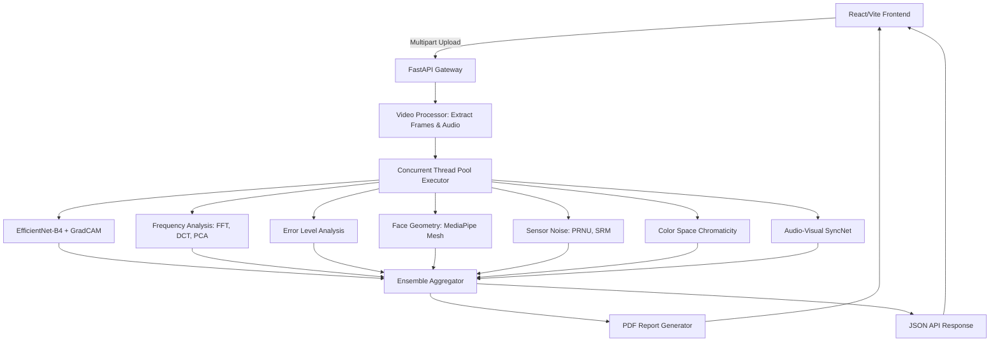

# 🕵️‍♂️ Deepfake Forensics & Explainable AI (XAI) Engine

<div align="center">
  <p><strong>A comprehensive, multi-modal ensemble system for detecting AI-generated media, digital manipulation, and deepfakes.</strong></p>
  <p>
    <a href="https://www.python.org/"></a>
    <a href="https://fastapi.tiangolo.com/"></a>
    <a href="https://react.dev/"></a>
    <a href="https://pytorch.org/"></a>
    <a href="https://opencv.org/"></a>
  </p>
</div>

---

## 📖 Executive Summary

As generative AI models (GANs, Diffusion Models, and sophisticated deepfake pipelines) approach photorealism, human visual inspection is no longer a reliable metric for media authenticity. 

The **Deepfake Forensics Platform** operates as a state-of-the-art digital forensics laboratory. Rather than relying on a monolithic "black-box" classifier, the system implements a **Multi-Modal Ensemble Architecture**. By dissecting media across biological, physical, frequency, and spectral dimensions, it achieves highly robust detection against out-of-distribution adversarial examples. Furthermore, it integrates **Explainable AI (XAI)** to generate court-grade PDF reports that mathematically justify its verdicts with interpretable visual evidence.

---

## 🎯 Core Detection Engines & Academic Foundations

The platform analyzes visual and auditory streams through up to 13 rigorously researched forensic methodologies:

### 1. Neural Network Attention (EfficientNet-B4 + XAI)
Utilizes a custom-finetuned [EfficientNet-B4](https://arxiv.org/abs/1905.11946) architecture trained via Contrastive Learning on datasets derived from the [Deepfake Detection Challenge (DFDC)](https://arxiv.org/abs/2006.07397). 
* **Grad-CAM Heatmaps:** Reverse-engineers the network's final convolutional layer (`_conv_head`) to generate spatial heatmaps, isolating the exact pixels (e.g., blending boundaries, unnatural eye-reflections) that triggered the synthetic classification ([Selvaraju et al., 2017](https://arxiv.org/abs/1610.02391)).
* **SHAP Feature Importance:** Applies a game-theoretic approach to rank which specific facial regions mathematically contributed most to the anomaly variance ([Lundberg & Lee, 2017](https://arxiv.org/abs/1705.07874)).

### 2. Spectral & Frequency Analysis
Generative AI inherently struggles to perfectly reconstruct the high-frequency macroscopic details inherent to physical camera sensors.
* **FFT & 2D DCT Spectrum:** Maps two-dimensional frequency coefficients to detect synthetic frequency-domain smoothing.
* **PCA (Principal Component Analysis):** Extracts the 3rd Principal Component (PC3) to reveal hidden periodic GAN artifacts.
* **Switching Noise (SWN):** Isolates high-frequency noise by finding zero-crossings in mathematical gradients, illuminating deepfake splicing seams.

### 3. Biological Face Geometry & Temporal Consistency
Maps 468 3D facial landmarks utilizing [MediaPipe Face Mesh](https://arxiv.org/abs/2006.10214) to evaluate biological impossibility.
* **Temporal Geometric Jitter:** Detects micro-stutters and physically impossible inter-frame vertex shifts, which are common in temporal GAN generation.
* **Proportional Asymmetry:** Analyzes structural interocular proportions and facial Golden Ratio distortions.

### 4. Error Level Analysis (ELA)
Detects heterogeneous compression signatures. When a fake face is spliced onto a real body, the manipulated region possesses a different JPEG compression quality than the original background.
* Re-saves the image at 95% quality and calculates the absolute pixel-wise difference.

### 5. Sensor Noise (PRNU/SRM)
* **Photo Response Non-Uniformity (PRNU):** Every digital camera sensor possesses a unique, microscopic hardware defect fingerprint. Deepfakes lack this hardware signature.
* **Spatial Rich Model (SRM):** Applies high-pass linear filtering to strip away primary image content, isolating the raw noise map. AI-generated face swaps violently disrupt this continuous noise matrix, causing the PRNU fingerprint to fail within the face bounding box ([Fridrich & Kodovsky, 2012](https://ieeexplore.ieee.org/document/6205615)).

### 6. Chrominance Color Space Mapping
While generative models are optimized to fool the human eye in the RGB spectrum, they frequently produce statistical aberrations in human-vision color spaces.
* Identifies mathematical anomalies in the **YCbCr** (Chrominance separation) and **LAB** (a* channel) spaces.

### 7. Audio-Visual Desynchronization (SyncNet)
In synthetic "lip-sync" deepfakes, the visual mouth movements often fail to achieve sub-millisecond synchronization with the audio phonemes.
* Extracts phonetic Mel-frequency cepstral coefficients (MFCCs) from the audio stream and correlates them with the visual Mouth Aspect Ratio (MAR) utilizing a modified **SyncNet** architecture ([Chung & Zisserman, 2016](https://arxiv.org/abs/1607.03985)).
* Computes **LSE-C** (Confidence) and **LSE-D** (Distance) to mathematically prove lip-sync tampering.

### 8. Physical Optics & Sensor Artifacts (CFA & Corneal)
Generative models struggle to accurately simulate physical optics and camera sensor hardware properties.
* **Corneal Specular Highlights:** Maps the reflection of light sources on the eyes. Real photos have mathematically consistent reflections across both spherical eyes, while AI models frequently render impossible, mismatched 3D reflections.
* **Color Filter Array (CFA) Artifacts:** Analyzes the Bayer filter interpolation. Genuine digital photos possess distinct periodic demosaicing patterns that AI generators overwrite or fail to produce.
* **3D Lighting Consistency:** Projects 3D normals onto the 2D image to estimate the directional light source. Detects contradictory shadow and lighting gradients typical of face swaps.

### 9. Physiological Forensics (rPPG)
Deepfakes frequently fail to synthesize the microscopic, heartbeat-induced color changes in human skin.
* **Remote Photoplethysmography (rPPG):** Extracts the subtle volumetric blood flow signals from facial regions of interest using spatial pooling and independent component analysis. Generates a Heart Rate Anomaly score based on the physiological impossibility of the detected BPM or SNR.

### 10. Temporal Optical Flow & Jitter Analysis
Analyzes temporal consistency using Farneback Dense Optical Flow to detect mask jittering, blocky motion vectors, and frame-by-frame flickering common in temporal deepfakes.

### 11. Acoustic Anti-Spoofing (Voice Liveness)
Analyzes an audio track for synthetic artifacts common in AI voice clones by evaluating zero-crossing rate variance, spectral rolloff, and high-frequency energy ratios.

### 12. Eye Movement & Blink Analysis
Computes the Eye Aspect Ratio (EAR) over time to detect unnaturally low blink rates, extreme glitching, or "lazy eye" gaze asymmetry characteristic of poorly rendered generative faces.

### 13. Cryptographic Metadata Integrity (EXIF)
Analyzes file headers to detect stripped EXIF data or specific cryptographic signatures left behind by generative manipulation software (e.g., Midjourney, DALL-E, Runway, Photoshop).

---

## 🏛 Court-Ready PDF Reporting
All automated analyses are compiled into a comprehensive, multi-page PDF report. The document is strictly formatted to provide an interpretable chain-of-evidence:
1. **Executive Verdict:** The overall ensemble confidence score and binary classification.
2. **Detailed Module Breakdown:** Isolated confidence metrics across all 13 analytical engines.
3. **Visual Evidence Gallery:** Embedded high-resolution heatmaps, gradient maps, and XAI overlays.
4. **Metadata Integrity:** Secure UUID assignment and ISO-8601 timestamping.

*(Disclaimer: Reports are generated by automated diagnostic algorithms and should be independently peer-reviewed by a certified forensic analyst prior to legal admission.)*

---

## 🚀 Getting Started

### Prerequisites
* Python 3.10+
* Node.js (v18+)
* `ffmpeg` installed and globally accessible via the system PATH.

### 1. Initialize the Backend (FastAPI / PyTorch)
The backend is architected for maximum throughput, utilizing a concurrent `ThreadPoolExecutor` to execute heavy OpenCV computations in parallel, bypassing the Python Global Interpreter Lock (GIL).

It is **highly recommended** to use a Virtual Environment to avoid cluttering your global system drive with gigabytes of PyTorch and OpenCV binaries.

```powershell
cd backend
python -m venv venv
.\venv\Scripts\Activate.ps1
pip install -r requirements.txt
uvicorn main:app --reload
```
*The REST API will initialize and bind to `http://127.0.0.1:8000`*

### 2. Initialize the Frontend Dashboard (React / Vite)
The user interface is a responsive, modern React application styled with custom CSS, featuring dark-mode glassmorphism and subtle micro-animations.

```bash
cd frontend
npm install
npm run dev
```
*The analytical dashboard will be accessible at `http://localhost:5173`*

### 3. Production Deployment
This repository is pre-configured for a modern, decoupled cloud deployment:

* **Backend (Hugging Face Spaces)**: The `backend/` directory contains a `Dockerfile` specifically designed to deploy the heavy PyTorch and OpenCV FastAPI server to a free [Hugging Face Space](https://huggingface.co/spaces) (using the Docker template).
* **Frontend (Vercel)**: The React dashboard is optimized for seamless deployment on Vercel. Be sure to configure the `VITE_API_URL` environment variable in your Vercel project settings to point to your live Hugging Face API URL (e.g., `https://username-spacename.hf.space`).

---

## 🏗 System Architecture



---

## 📚 Academic References & Citations
* **EfficientNet:** Tan, M., & Le, Q. (2019). *EfficientNet: Rethinking Model Scaling for Convolutional Neural Networks*. ICML. ([Link](https://arxiv.org/abs/1905.11946))
* **Grad-CAM:** Selvaraju, R. R., et al. (2017). *Grad-CAM: Visual Explanations from Deep Networks via Gradient-based Localization*. ICCV. ([Link](https://arxiv.org/abs/1610.02391))
* **SyncNet:** Chung, J. S., & Zisserman, A. (2016). *Out of time: automated lip sync in the wild*. ACCV. ([Link](https://arxiv.org/abs/1607.03985))
* **Sensor Noise (SRM):** Fridrich, J., & Kodovsky, J. (2012). *Rich Models for Steganalysis of Digital Images*. IEEE Transactions on Information Forensics and Security. ([Link](https://ieeexplore.ieee.org/document/6205615))
* **DFDC:** Dolhansky, B., et al. (2020). *The Deepfake Detection Challenge (DFDC) Dataset*. ([Link](https://arxiv.org/abs/2006.07397))
* **Face Mesh:** Grishchenko, I., et al. (2020). *Attention Mesh: High-fidelity Face Mesh Prediction in Real-time*. CVPR Workshop. ([Link](https://arxiv.org/abs/2006.10214))
* **ELA:** Krawetz, N. (2007). *A Picture's Worth: Digital Image Analysis and Forensics*. Black Hat. ([Link](https://www.hackerfactor.com/papers/bh-usa-07-krawetz-wp.pdf))

### User Provided Reference Links
* **DCT 8x8:** NVIDIA CUDA Guide ([Link](https://developer.download.nvidia.com/assets/cuda/files/dct8x8.pdf))
* **FFT Analysis Guide:** Dewesoft Blog ([Link](https://dewesoft.com/blog/guide-to-fft-analysis))
* **Cepstrum Analysis:** MathWorks Documentation ([Link](https://www.mathworks.com/help/signal/ug/cepstrum-analysis.html))
* **DWT2 Analysis:** MathWorks Documentation ([Link](https://www.mathworks.com/help/wavelet/ref/dwt2.html))
* **Wavelet Transform:** Medium Article ([Link](https://medium.com/pythoneers/wavelet-transform-a-practical-approach-to-time-frequency-analysis-662bdadeb08b))
* **PRNU / Fixed Pattern Noise:** 
  * Jim Kasson's Blog ([Link](https://blog.kasson.com/the-last-word/pixel-response-non-uniformity-fixed-pattern-noise-in-the-light/))
  * Harvest Imaging ([Link](https://harvestimaging.com/blog/?p=916))
  * PhotonsToPhotos ([Link](https://www.photonstophotos.net/GeneralTopics/Sensors_&_Raw/Sensor_Analysis_Primer/Fixed_Pattern_Noise_Analysis.htm))
* **Color Spaces:** Uni Weimar PDF ([Link](https://www.uni-weimar.de/fileadmin/user/fak/medien/professuren/Computer_Graphics/3-ima-color-spaces17.pdf))
* **Hyperspectral Image Classification:** Medium Article ([Link](https://medium.com/abraia/hyperspectral-image-classification-with-python-7dce4ebcda0a))
* **Additional Papers & PubMed Articles:**
  * MDPI Article ([Link](https://www.mdpi.com/2076-3417/14/11/4642))
  * PMC3715259 ([Link](https://pmc.ncbi.nlm.nih.gov/articles/PMC3715259/))
  * PMC4398689 ([Link](https://pmc.ncbi.nlm.nih.gov/articles/PMC4398689/))
  * PMC9609198 ([Link](https://pmc.ncbi.nlm.nih.gov/articles/PMC9609198/))
  * ECCV 2024 Supplementary Paper ([Link](https://www.ecva.net/papers/eccv_2024/papers_ECCV/papers/02950-supp.pdf))

### Academic & Technical Deepfake Forensics References
* **SyncNet / Lip-Sync Analysis:** Chung, J. S., & Zisserman, A. (2016). *Out of time: automated lip sync in the wild*. ACCV. ([Link](https://arxiv.org/abs/1607.05046))
* **Wav2Lip Audio-Visual Sync:** Prajwal, K. R., et al. (2020). *A Lip Sync Expert Is All You Need for Speech to Lip Generation In the Wild*. ACM Multimedia. ([Link](https://arxiv.org/abs/2008.10010))
* **Frequency Domain Discrepancies:** Dzanic, T., et al. (2020). *Fourier Spectrum Discrepancies in Deep Network Generated Images*. NeurIPS. ([Link](https://arxiv.org/abs/1911.06465))
* **CNN Spatial Artifacts:** Wang, S. Y., et al. (2020). *CNN-generated images are surprisingly easy to spot... for now*. CVPR. ([Link](https://arxiv.org/abs/1912.08195))
* **Face Warping Artifacts:** Li, Y., & Lyu, S. (2018). *Exposing DeepFake Videos By Detecting Face Warping Artifacts*. IEEE CVPRW. ([Link](https://arxiv.org/abs/1811.00656))
* **Switching Noise Filter (SWN):** Ranjbaran, M., et al. (2015). *A New Method for Impulse Noise Detection in Digital Images*. ([Link](https://ieeexplore.ieee.org/document/7306019))

---

## ⚖️ License & Ethical Use
This software is strictly provided for research, digital forensics, and investigative journalism purposes. Any malicious use, or utilizing these analytical pipelines to reverse-engineer and train adversary deepfake generators, is fundamentally prohibited.

**Deepfake Forensics Platform © 2026**
