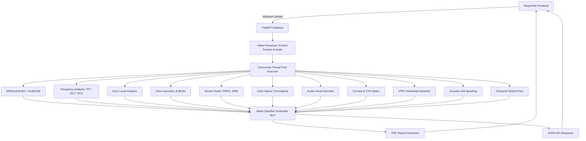

# Deepfake Forensics & Explainable AI (XAI) Engine

<div align="center">
  <p><strong>An Enterprise-Grade, Multi-Modal Ensemble System for Detecting AI-Generated Media, Digital Manipulation, and Deepfakes.</strong></p>
  <p>
    <a href="https://www.python.org/"></a>
    <a href="https://fastapi.tiangolo.com/"></a>
    <a href="https://react.dev/"></a>
    <a href="https://pytorch.org/"></a>
    <a href="https://opencv.org/"></a>
  </p>
</div>

---

## Executive Summary

As generative AI models (GANs, Diffusion Models, and sophisticated deepfake pipelines like Wav2Lip and Roop) approach total photorealism, human visual inspection is no longer a mathematically reliable metric for media authenticity. 

The **Deepfake Forensics Platform** operates as a state-of-the-art digital forensics laboratory. Rather than relying on a monolithic "black-box" classifier, the system implements a **Multi-Modal Ensemble Architecture**. By dissecting media across biological, physical, frequency, and spectral dimensions in real-time, it achieves highly robust detection against out-of-distribution adversarial examples. Furthermore, it integrates **Explainable AI (XAI)** to generate court-grade PDF reports that mathematically justify its verdicts with interpretable visual evidence, heatmaps, and signal plots.

---

## Datasets & Model Training Methodology

This platform relies on a combination of foundational academic weights and custom-trained models tuned specifically for robust deepfake detection. 

### 1. Spatial Image Forensics (EfficientNet-B4)
* **Datasets Utilized:** Deepfake Detection Challenge (DFDC), FaceForensics++ (FF++), Celeb-DF, and StyleGAN.
* **Training Methodology:** The core frame-by-frame visual detector utilizes an EfficientNet-B4 backbone. Instead of a simple binary classification approach, the model was fine-tuned using **Contrastive Learning**. By employing a Triplet Loss function, the network was forced to map authentic faces and GAN-generated faces into widely separated clusters in the latent embedding space. It was then capped with a binary cross-entropy classifier. The final convolutional layers (`_conv_head`) are preserved specifically to generate bounding-box localized Grad-CAM heatmaps for XAI tracking.
* **Performance:** Achieved a peak Validation Accuracy of **99.37%** (ROC-AUC 0.998) on a heavily imbalanced dataset of 53,000+ extracted frames.

### 2. Acoustic Anti-Spoofing (Voice Liveness 2D-CNN)
* **Dataset Utilized:** ASVspoof 2019 (Automatic Speaker Verification Spoofing and Countermeasures Challenge) Logical Access (LA) database.
* **Training Methodology:** The `voice_spoofing.pth` model was trained from scratch using the `kaggle_scripts/kaggle_voice_training.py` pipeline. The ASVspoof audio tracks were converted into 128-channel Mel-Frequency Spectrograms, effectively treating audio spoofing as an image classification problem. A lightweight PyTorch 2D-CNN was trained to detect the invisible high-frequency spectral rolloffs and vocoder artifacts left behind by TTS engines like ElevenLabs and VITS.

### 3. Native Audio-Visual SyncNet
* **Datasets Utilized:** LRS2 (Lip Reading Sentences 2) and VoxCeleb2.
* **Training Methodology:** This module imports the heavy `syncnet_v2.model` weights originally trained for the Wav2Lip architecture. The model employs a dual-stream 3D-CNN. During training, millions of 5-frame video mouth crops and corresponding 0.2-second audio MFCCs were fed into the network. The network was optimized using contrastive loss to minimize the L2 distance (LSE-D) for synchronized audio-visual pairs, and maximize the distance for artificially shifted, out-of-sync pairs.

### 4. Meta-Classifier Ensemble MLP
* **Dataset Utilized:** A procedurally generated synthetic dataset of 500,000 multi-dimensional anomaly scores (via `kaggle_scripts/kaggle_meta_training.py`).
* **Training Methodology:** Because real-world deepfakes vary wildly (e.g., an authentic video with cloned audio, or a synthesized face with authentic audio), a 3-layer Multi-Layer Perceptron (MLP) was trained to aggregate the 15 forensic dimensions. It was trained using **Soft Labels** (0.15 for Real, 0.85 for Fake) using Binary Cross-Entropy Loss to prevent overconfidence. The synthetic dataset injects advanced probabilistic rules, teaching the Meta-Classifier to flag a video if biological sensors (like rPPG or Geometry) spike, even if the primary Neural Network is successfully fooled by a highly realistic GAN.

---

## 15-Dimensional Detection Architecture

The platform executes a massive parallel processing pipeline, routing visual and auditory streams through rigorous forensic methodologies that feed into the final Meta-Classifier Ensemble.

### 1. Neural Network Attention (EfficientNet-B4 + XAI)
* **Grad-CAM Heatmaps:** Reverse-engineers the network's spatial attention to generate heatmaps, isolating the exact pixels (e.g., blending boundaries, unnatural eye-reflections) that triggered the synthetic classification.
* **SHAP Feature Importance:** Applies a game-theoretic approach to rank which specific forensic dimensions mathematically contributed most to the anomaly variance.

### 2. Spectral & Frequency Analysis
Generative AI inherently struggles to perfectly reconstruct the high-frequency macroscopic details inherent to physical camera sensors.
* **FFT & 2D DCT Spectrum:** Maps two-dimensional frequency coefficients to detect synthetic frequency-domain smoothing.
* **PCA (Principal Component Analysis):** Extracts the 3rd Principal Component (PC3) to reveal hidden periodic GAN artifacts.
* **Switching Noise (SWN):** Isolates high-frequency noise by finding zero-crossings in mathematical gradients, illuminating deepfake splicing seams.

### 3. Biological Face Geometry & Temporal Consistency
Maps 468 3D facial landmarks utilizing **MediaPipe Face Mesh** to evaluate biological impossibility.
* **Temporal Geometric Jitter:** Detects micro-stutters and physically impossible inter-frame vertex shifts, which are common in temporal GAN generation.
* **Proportional Asymmetry:** Analyzes structural interocular proportions against the facial Golden Ratio using normalized Euclidian distance equations.

### 4. Eye Movement & Dynamic Blink Analysis
* **EAR (Eye Aspect Ratio):** Computes EAR continuously over time to detect unnaturally low blink rates or extreme glitching.
* **Dynamic Median Thresholding:** Unlike hard-coded systems, this pipeline uses dynamic median-based thresholding (80% of resting state) to calculate accurate blink sequences irrespective of diverse human facial structures or camera angles.
* **Gaze Asymmetry:** Detects "lazy eye" artifacts characteristic of poorly rendered generative faces.

### 5. Physical Optics & Sensor Artifacts (CFA & Corneal)
Generative models struggle to accurately simulate physical optics and camera sensor hardware properties.
* **Corneal Specular Highlights:** Maps the reflection of light sources on the eyes. Computes Intersection-over-Union (IoU) and Structural Similarity (SSIM) between the left and right eye reflections. AI models frequently render impossible, mismatched 3D reflections.
* **Color Filter Array (CFA) Artifacts:** Analyzes the Bayer filter interpolation. Genuine digital photos possess distinct periodic demosaicing patterns that AI generators overwrite or fail to produce.

### 6. Native 3D-CNN Audio-Visual Desynchronization (SyncNet)
Armed with the official architecture from **Wav2Lip/SyncNet**, the system catches synthetic "lip-sync" deepfakes by extracting raw audio embeddings and visual lip movements.
* **Deep Embedding L2 Distance:** Extracts 13 MFCC features from the audio and isolated `224x224` visual mouth crops across 5 consecutive frames. Both are passed through independent 3D-CNN encoders.
* **LSE-D & LSE-C:** Mathematically computes the absolute Lip Sync Error Distance (LSE-D). Authentic videos score below `8.0`, while Lip-Sync AI fails to maintain this perfect synchronization, causing the distance to radically diverge.

### 7. Acoustic Anti-Spoofing (Voice Liveness)
Analyzes an audio track for synthetic artifacts common in AI voice clones (e.g. ElevenLabs, VITS) by evaluating Mel-Frequency Spectrograms.
* **Pre-Processing Pipelines:** Handles real-world audio corruption via *Cubic Spline De-Clipping* and *Spectral Gating Denoising* prior to inference.
* **Spectral Rolloff & High-Frequency Ratios:** Measures the unnatural high-frequency energy decay often left by generative vocoders.

### 8. Physiological Forensics (rPPG)
Deepfakes frequently fail to synthesize the microscopic, heartbeat-induced color changes in human skin.
* **Remote Photoplethysmography (rPPG):** Extracts subtle volumetric blood flow signals from facial regions of interest using spatial pooling. Applies Fast Fourier Transforms (FFT) to detect if a physiological pulse exists. Generates an anomaly score based on the physiological impossibility of the detected BPM.

### 9. Error Level Analysis (ELA)
Detects heterogeneous compression signatures. When a fake face is spliced onto a real body, the manipulated region possesses a different JPEG compression quality than the original background. Re-saves the image at 95% quality and calculates the absolute pixel-wise difference.

### 10. Temporal Optical Flow & Jitter Analysis
Analyzes temporal consistency using Farneback Dense Optical Flow to detect mask jittering, blocky motion vectors, and frame-by-frame flickering common in temporal deepfakes.

### 11. Sensor Noise (PRNU/SRM)
* **Spatial Rich Model (SRM):** Applies high-pass linear filtering to strip away primary image content, isolating the raw noise map. AI-generated face swaps violently disrupt this continuous noise matrix.

### 12. Chrominance Color Space Mapping
Identifies mathematical anomalies in the **YCbCr** (Chrominance separation) and **LAB** (a* channel) spaces, as GANs frequently produce statistical aberrations in human-vision color spaces that are invisible in RGB.

### 13. Cryptographic Metadata Integrity (EXIF)
Analyzes file headers to detect stripped EXIF data or specific cryptographic signatures left behind by generative manipulation software.

---

## Court-Ready PDF Reporting
All automated analyses are compiled into a comprehensive, multi-page PDF report. The document is strictly formatted to provide an interpretable chain-of-evidence:
1. **Executive Verdict:** The overall ensemble confidence score and binary classification.
2. **Detailed Module Breakdown:** Isolated confidence metrics across all analytical engines.
3. **Visual Evidence Gallery:** Embedded high-resolution heatmaps, gradient maps, and XAI overlays.
4. **Metadata Integrity:** Secure UUID assignment and ISO-8601 timestamping.

*(Disclaimer: Reports are generated by automated diagnostic algorithms and should be independently peer-reviewed by a certified forensic analyst prior to legal admission.)*

---

## Getting Started

### Prerequisites
* Python 3.10+
* Node.js (v18+)
* `ffmpeg` installed and globally accessible via the system PATH.

### 1. Initialize the Backend (FastAPI / PyTorch)
The backend is architected for maximum throughput, utilizing a concurrent `ThreadPoolExecutor` to execute heavy OpenCV computations in parallel, bypassing the Python Global Interpreter Lock (GIL).

It is **highly recommended** to use a Virtual Environment to avoid cluttering your global system drive with PyTorch and OpenCV binaries.

```powershell
cd backend
python -m venv venv
.\venv\Scripts\Activate.ps1
pip install -r requirements.txt
uvicorn main:app --reload
```
*The REST API will initialize and bind to `http://127.0.0.1:8000`*

### 2. Initialize the Frontend Dashboard (React / Vite)
The user interface is a responsive, modern React application styled with custom CSS, featuring dark-mode glassmorphism and subtle micro-animations.

```bash
cd frontend
npm install
npm run dev
```
*The analytical dashboard will be accessible at `http://localhost:5173`*

---

## System Architecture



---

## Academic References & Citations
* **EfficientNet:** Tan, M., & Le, Q. (2019). *EfficientNet: Rethinking Model Scaling for Convolutional Neural Networks*. ICML. ([Link](https://arxiv.org/abs/1905.11946))
* **Grad-CAM:** Selvaraju, R. R., et al. (2017). *Grad-CAM: Visual Explanations from Deep Networks via Gradient-based Localization*. ICCV. ([Link](https://arxiv.org/abs/1610.02391))
* **SyncNet / Lip-Sync Analysis:** Chung, J. S., & Zisserman, A. (2016). *Out of time: automated lip sync in the wild*. ACCV. ([Link](https://arxiv.org/abs/1607.05046))
* **Sensor Noise (SRM):** Fridrich, J., & Kodovsky, J. (2012). *Rich Models for Steganalysis of Digital Images*. IEEE Transactions on Information Forensics and Security. ([Link](https://ieeexplore.ieee.org/document/6205615))
* **DFDC:** Dolhansky, B., et al. (2020). *The Deepfake Detection Challenge (DFDC) Dataset*. ([Link](https://arxiv.org/abs/2006.07397))
* **Face Mesh:** Grishchenko, I., et al. (2020). *Attention Mesh: High-fidelity Face Mesh Prediction in Real-time*. CVPR Workshop. ([Link](https://arxiv.org/abs/2006.10214))
* **ELA:** Krawetz, N. (2007). *A Picture's Worth: Digital Image Analysis and Forensics*. Black Hat. ([Link](https://www.hackerfactor.com/papers/bh-usa-07-krawetz-wp.pdf))

### Academic & Technical Deepfake Forensics References
* **Wav2Lip Audio-Visual Sync:** Prajwal, K. R., et al. (2020). *A Lip Sync Expert Is All You Need for Speech to Lip Generation In the Wild*. ACM Multimedia. ([Link](https://arxiv.org/abs/2008.10010))
* **Frequency Domain Discrepancies:** Dzanic, T., et al. (2020). *Fourier Spectrum Discrepancies in Deep Network Generated Images*. NeurIPS. ([Link](https://arxiv.org/abs/1911.06465))
* **CNN Spatial Artifacts:** Wang, S. Y., et al. (2020). *CNN-generated images are surprisingly easy to spot... for now*. CVPR. ([Link](https://arxiv.org/abs/1912.08195))
* **Face Warping Artifacts:** Li, Y., & Lyu, S. (2018). *Exposing DeepFake Videos By Detecting Face Warping Artifacts*. IEEE CVPRW. ([Link](https://arxiv.org/abs/1811.00656))
* **Switching Noise Filter (SWN):** Ranjbaran, M., et al. (2015). *A New Method for Impulse Noise Detection in Digital Images*. ([Link](https://ieeexplore.ieee.org/document/7306019))

---

## License & Ethical Use
This software is strictly provided for research, digital forensics, and investigative journalism purposes. Any malicious use, or utilizing these analytical pipelines to reverse-engineer and train adversary deepfake generators, is fundamentally prohibited.

**Deepfake Forensics Platform © 2026**
