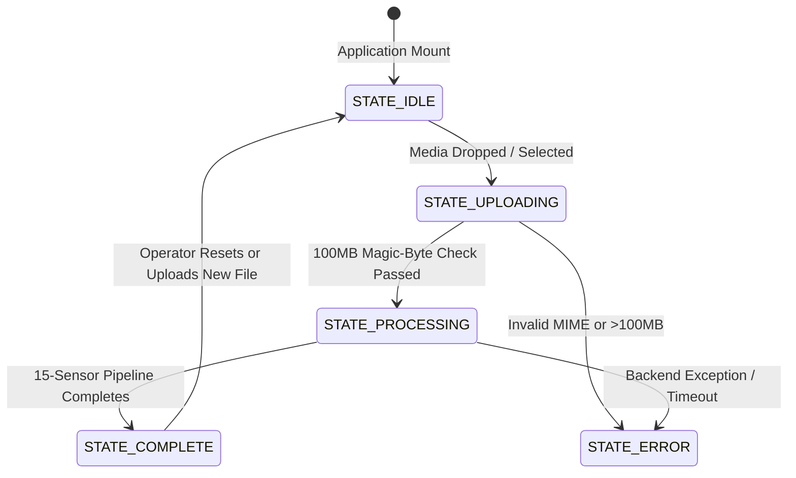

# DeepForensics Suite — Master UI/UX Design System Specification (`design.md`)

> **Version**: 3.0.0 (Production Blueprint for Stitch & Modern Frontend Engineering)  
> **Target Audience**: Forensic Analysts, Digital Intelligence Investigators, Federal Legal Auditors, Security Engineers.  
> **Core Ethos**: *Institutional Precision, Evidentiary Rigor, and Zero AI-Slop.*  
> **Aesthetic Archetype**: High-density investigative workstation inspired by **Palantir Foundry / Gotham**, **Linear**, **Bloomberg Terminal**, and **Bellingcat Open-Source Intelligence Tooling**.

---

## Table of Contents
1. [Visual Philosophy & Anti-"AI Slop" Directives](#1-visual-philosophy--anti-ai-slop-directives)
2. [Complete Design Token System (CSS / Tailwind / Stitch)](#2-complete-design-token-system)
3. [Typography & Mathematical Typesetting Engine](#3-typography--mathematical-typesetting-engine)
4. [Global Application Shell & Navigation](#4-global-application-shell--navigation)
5. [State Machine & Workflow Architecture](#5-state-machine--workflow-architecture)
6. [Detailed Screen Specifications](#6-detailed-screen-specifications)
   - [Screen 1: Case Ingestion & Media Pre-Flight Console](#screen-1-case-ingestion--media-pre-flight-console)
   - [Screen 2: Live Pipeline Telemetry Terminal](#screen-2-live-pipeline-telemetry-terminal)
   - [Screen 3: Master Forensic Dossier (The Analysis Workspace)](#screen-3-master-forensic-dossier-the-analysis-workspace)
   - [Screen 4: Deep-Dive Forensic Module Specifications (All 15 Sensors)](#screen-4-deep-dive-forensic-module-specifications)
   - [Screen 5: Model Weights & Architectural Benchmarks](#screen-5-model-weights--architectural-benchmarks)
   - [Screen 6: Case History & Audit Log](#screen-6-case-history--audit-log)
7. [Micro-Interactions, Video Scrubbing & Keyboard Navigation](#7-micro-interactions-video-scrubbing--keyboard-navigation)
8. [API-to-UI Data Binding Contracts](#8-api-to-ui-data-binding-contracts)
9. [Court-Admissible PDF Export Specifications](#9-court-admissible-pdf-export-specifications)
10. [Accessibility, Contrast & Performance Budgets](#10-accessibility-contrast--performance-budgets)

---

## 1. Visual Philosophy & Anti-"AI Slop" Directives

### 1.1 What Defines "AI Slop" in Web Apps (What We Strictly Prohibit)
* ❌ **Gratuitous Gradients**: Purple-to-pink or blue-to-cyan gradient borders, text fills, and floating nebulas behind cards.
* ❌ **Fuzzy Glassmorphism**: Overdone backdrop filters (`blur(24px)`) on low-opacity backgrounds that wash out contrast and make text illegible.
* ❌ **Giant Vacuous Cards**: 300px tall containers holding 2 lines of text and a stock icon.
* ❌ **Vague Buzzwords**: "Powered by Advanced Neural Next-Gen AI" without model names, parameter counts, or error rates.
* ❌ **Bouncy / Cartoonish Animations**: Spring/elastic bounces, cards that tilt on mouse movement, or spinning decorative rings that communicate nothing.

### 1.2 Our Institutional Design Directives
* ✔ **Matte Carbon & Hairline Borders**: Solid, high-contrast surfaces (`#090D16`, `#0F172A`) separated by crisp 1px borders (`#1E293B`, `#334155`).
* ✔ **Information Density**: Pack meaningful data into compact, scannable structures: tabular numbers, mono chips, confidence bounds, and small multi-line metadata.
* ✔ **Deterministic Color Semantics**: Every color has an unshakeable evidentiary meaning:
  - **Red/Rose (`#F43F5E`)**: Synthetic Anomaly Detected / Fake Impersonation.
  - **Amber/Gold (`#F59E0B`)**: Benign AI Alteration / Portrait Filter / Retouched.
  - **Emerald/Mint (`#10B981`)**: Authentic Human / Physical Hardware Pass.
  - **Cobalt/Sky (`#38BDF8`)**: Neutral Telemetry / Sensor Measurement / Active Selection.
* ✔ **Monospaced Rigor**: Every hash, timestamp, frame coordinate, sensor score, and p-value is rendered in tabular monospace font (`font-feature-settings: "tnum" 1`).
* ✔ **Verifiable Mathematical Backing**: Every analytical claim displays its formula (via KaTeX typesetting) and its baseline statistical threshold.

---

## 2. Complete Design Token System

```css
:root {
  /* ==========================================================================
     SURFACE LAYERS (Pure Matte, Non-Blurry, 100% Solid & Opaque Surfaces)
     ========================================================================== */
  --surface-canvas:       #06080E; /* Deepest screen background */
  --surface-base:         #0A0E17; /* Root workspace container */
  --surface-panel:        #0F1626; /* Primary elevated functional panels */
  --surface-card:         #151F34; /* Interactive card / module surface */
  --surface-hover:        #1C2A45; /* Interactive hover elevation */
  --surface-active:       #243657; /* Pressed / selected item surface */
  --surface-inset:        #04060A; /* Terminals, code blocks, video well */

  /* ==========================================================================
     BORDERS & STRUCTURAL HAIRLINES (1px Crisp Dividers)
     ========================================================================== */
  --border-subtle:        #182338; /* Background section boundaries */
  --border-default:       #243350; /* Card outlines & table dividers */
  --border-strong:        #3A4E75; /* Focused inputs, active tabs, modal borders */
  --border-accent:        #38BDF8; /* Selection indicator / cursor */

  /* ==========================================================================
     FORENSIC EVIDENTIARY SEMANTICS
     ========================================================================== */
  /* Critical / Deepfake / Synthetic Detection */
  --forensic-fake:        #F43F5E; /* Rose 500 */
  --forensic-fake-hover:  #E11D48; /* Rose 600 */
  --forensic-fake-subtle: #2D1019; /* Subdued container fill */
  --forensic-fake-border: #881337; /* High-contrast border */

  /* Warning / Benign Alteration / Gemini Filter */
  --forensic-altered:       #F59E0B; /* Amber 500 */
  --forensic-altered-hover: #D97706; /* Amber 600 */
  --forensic-altered-subtle:#2D1E08; /* Subdued container fill */
  --forensic-altered-border:#78350F; /* High-contrast border */

  /* Authentic / Genuine Hardware Signature */
  --forensic-real:        #10B981; /* Emerald 500 */
  --forensic-real-hover:  #059669; /* Emerald 600 */
  --forensic-real-subtle: #062319; /* Subdued container fill */
  --forensic-real-border: #064E3B; /* High-contrast border */

  /* Telemetry / Informational / Calibration */
  --forensic-info:        #38BDF8; /* Sky 400 */
  --forensic-info-subtle: #082032; /* Subdued container fill */
  --forensic-info-border: #075985; /* High-contrast border */

  /* ==========================================================================
     TYPOGRAPHIC TOKENS
     ========================================================================== */
  --text-high:            #F8FAFC; /* 100% white - Primary headers, key values */
  --text-medium:          #CBD5E1; /* 85% slate - Body copy, findings */
  --text-low:             #94A3B8; /* 60% slate - Table headers, labels, descriptions */
  --text-muted:           #64748B; /* 40% slate - Inactive states, metadata, dates */
  --text-mono:            #7DD3FC; /* High-contrast cyan for tabular code & hashes */

  /* ==========================================================================
     SPACING & RADIUS SYSTEM (Tight, Architectural Geometry)
     ========================================================================== */
  --radius-xs:            2px;
  --radius-sm:            4px;
  --radius-md:            6px;
  --radius-lg:            8px;
  --radius-pill:          9999px;

  --space-1:              4px;
  --space-2:              8px;
  --space-3:              12px;
  --space-4:              16px;
  --space-5:              20px;
  --space-6:              24px;
  --space-8:              32px;
  --space-12:             48px;

  /* ==========================================================================
     SHADOWS & AMBIENT DEPTH (No blurry glow; crisp directional occlusion)
     ========================================================================== */
  --shadow-sm:            0 1px 2px 0 rgba(0, 0, 0, 0.5);
  --shadow-md:            0 4px 6px -1px rgba(0, 0, 0, 0.6), 0 2px 4px -2px rgba(0, 0, 0, 0.4);
  --shadow-lg:            0 10px 15px -3px rgba(0, 0, 0, 0.8), 0 4px 6px -4px rgba(0, 0, 0, 0.6);
  --shadow-modal:         0 25px 50px -12px rgba(0, 0, 0, 0.95);
}
```

---

## 3. Typography & Mathematical Typesetting Engine

### 3.1 Font Stack Specifications
* **Primary Sans-Serif**: `Inter`, `-apple-system`, `BlinkMacSystemFont`, `"Segoe UI"`, `Roboto`, `sans-serif`
  - Applied with: `font-feature-settings: "cv02" 1, "cv03" 1, "cv04" 1, "cv11" 1;`
* **Data / Hash / Monospace**: `JetBrains Mono`, `Geist Mono`, `"SF Mono"`, `Consolas`, `monospace`
  - Applied with: `font-feature-settings: "tnum" 1, "zero" 1;` (Ensures tabular numbers never jump horizontal alignment).
* **Forensic Seals / Legal Dossier Headers**: `Newsreader`, `Times New Roman`, `serif`
  - Applied strictly on certified export seals and judicial headers for high evidentiary gravitas.

### 3.2 Typesetting Scale

| Token | Family | Size | Line Height | Tracking | Weight | Exact Usage |
| :--- | :--- | :--- | :--- | :--- | :--- | :--- |
| `display-1` | Sans | 32px | 38px | `-0.035em` | 800 | Primary Console Headings |
| `title-1` | Sans | 22px | 28px | `-0.025em` | 700 | Panel & Drawer Headings |
| `title-2` | Sans | 16px | 22px | `-0.015em` | 600 | Sensor Cards & Section Headers |
| `body-primary` | Sans | 13px | 20px | `-0.005em` | 400 | Analytical Descriptions & Findings |
| `body-bold` | Sans | 13px | 20px | `-0.005em` | 600 | Emphasized finding terms |
| `caption` | Sans | 11px | 16px | `0` | 500 | Explanatory subtext, tooltips |
| `mono-stat` | Mono | 20px | 24px | `0` | 700 | Big Metric KPIs (99.85%, 0.00012) |
| `mono-code` | Mono | 12px | 18px | `+0.01em` | 500 | Hashes, coordinates, sensor values |
| `badge-mono` | Mono | 10px | 14px | `+0.08em` | 700 | Status Chips, Thresholds (UPPERCASE) |

---

## 4. Global Application Shell & Navigation

```
┌────────────────────────────────────────────────────────────────────────────────────────────────────────┐
│ [🛡️ DEEPFORENSICS SUITE]  CASE: #DF-2026-8841  •  TARGET: interview_leak.mp4 (48.2 MB)  •  CORE: ONLINE│
├────────────────────────────────────────────────────────────────────────────────────────────────────────┤
│ [1. INTAKE & TRIAGE]    [2. FORENSIC DOSSIER]    [3. SENSOR LAB]    [4. MODEL WEIGHTS]   [5. AUDIT LOG]│
├────────────────────────────────────────────────────────────────────────────────────────────────────────┤
```

### 4.1 Header Bar Specs
* **Height**: `56px` fixed.
* **Left**:
  - Shield Icon in Emerald/Cobalt (`20px`).
  - Wordmark: `DeepForensics` in `title-2` bold, followed by a hairline tag `v2.5-ENTERPRISE`.
  - Live Case Chip: `#DF-2026-8841` (Clicking copies Case UUID to clipboard with discreet toast).
* **Center**:
  - Global Navigation Tabs with active indicator bar (2px solid `--forensic-info` at bottom).
* **Right**:
  - **Core Health Indicator**: Pulsing green dot with `CUDA 12.1 • 15 SENSORS ARMED`.
  - **Quick Action**: `[Export PDF Dossier]` button (`btn-secondary`).
  - **GitHub Repo Link**: Clean icon button with commit hash tooltip.

---

## 5. State Machine & Workflow Architecture

The application transitions through five rigid states:



1. **`STATE_IDLE`**: Displays the high-density Intake Workspace with pre-flight dropzone and benchmark sample files.
2. **`STATE_UPLOADING`**: Displays byte-stream ingestion progress bar with cryptographic SHA-256 chunk hashing.
3. **`STATE_PROCESSING`**: Renders the non-scrolling two-column Live Terminal Scrubber showing real-time tensor worker milestones and hardware telemetry.
4. **`STATE_COMPLETE`**: Transitions automatically to the Master Forensic Dossier with Executive Verdict, curtain comparison video canvas, and 15-sensor spectrum.
5. **`STATE_ERROR`**: Displays an evidentiary triage modal explaining the failure mode (e.g., *Disguised MIME payload*, *Corrupted container atom*, *No human faces detected in video frames*), with a 1-click retry.

---

## 6. Detailed Screen Specifications

### Screen 1: Case Ingestion & Media Pre-Flight Console

#### Visual Layout
A centered `1140px` workspace containing:
1. **Investigation Intake Dropzone**:
   - Matte slate background (`--surface-panel`), 1px dashed border (`--border-default`), hover turns 1px solid (`--forensic-info`).
   - Drag-and-drop target with automatic client-side pre-flight inspection.
   - **Immediate Client-Side Inspection Metrics**:
     - MIME validation: Confirms real container against magic bytes (`ftypmp42`, `RIFF`, `PNG`).
     - Video Duration Clamping: Warns if $>60\text{s}$ (automatic first 60 seconds analyzed).
     - Audio Stream Presence: Badges `AUDIO_PRESENT (48 kHz)` or `SILENT_TRACK (Modality Masking Armed)`.
2. **Standard Evaluation Test Corpus**:
   - Quick-load benchmark buttons for instant verification without finding local files:
     - `Load Celeb-DF v2 Test Sample` (Manipulated Face Swap).
     - `Load StyleGAN 140k Faces Sample` (Transposed Convolution Synthetic).
     - `Load Authentic C-SPAN Camera Baseline` (Pristine Camera Sensor).

---

### Screen 2: Live Pipeline Telemetry Terminal

#### Purpose
Replaces generic spinning loaders with an auditable execution terminal. Fits completely within the viewport (no page scrolling).

```
┌────────────────────────────────────────────────────────────────────────────────────────────────┐
│  PIPELINE EXECUTION: 15 SENSORS ACTIVE                   TIME ELAPSED: 00:04.82                │
├───────────────────────────────────────────────┬────────────────────────────────────────────────┤
│  SEQUENCE STEPS                               │  TELEMETRY & WORKER LOGS                       │
│  ───────────────────────────────              │  ─────────────────────────────                 │
│  [✓] 1. Stream Ingestion & Magic-Bytes (05%) │  ACTIVE MODEL: Ensemble (EfficientNet + Sync)  │
│  [✓] 2. PySceneDetect & Face Tracking   (10%) │  VRAM: 4.2 GB / 16.0 GB (CUDA 12.1)           │
│  [✓] 3. EfficientNet-B4 + CBAM Infer    (15%) │  BACKEND: PyTorch 2.6 JIT                      │
│  [⏳] 4. Dual-Res Grad-CAM Attention     (30%) │  BATCH: 32 Frames/sec                         │
│  [ ] 5. 2D FFT & DCT Spectral Pool      (45%) │  ────────────────────────────────────────────  │
│  [ ] 6. Bayer CFA & PRNU Sensor Noise   (55%) │  [00:01.12] [OK] Video decimation: 128 frames  │
│  [ ] 7. Photometric 3D Harmonics        (65%) │  [00:02.45] [OK] MediaPipe face tracked: 1 face│
│  [ ] 8. Cardiovascular rPPG (CHROM)     (75%) │  [00:03.80] [INFO] Extracting CBAM layer-4 map │
│  [ ] 9. SyncNet 1024-D Lip Sync         (80%) │  [00:04.10] [WAIT] Computing FFT azimuthal avg │
│  [ ] 10. Meta-Classifier Arbitration    (85%) │  > Dispatching feature vectors to ResNet... _  │
│  [ ] 11. PDF Dossier Synthesis          (90%) │                                                │
└───────────────────────────────────────────────┴────────────────────────────────────────────────┘
```

#### Key Engineering Details
* **Internal Log Auto-Scroll**: Uses `logContainerRef.current.scrollTop = logContainerRef.current.scrollHeight` (never calls `scrollIntoView` on the browser window).
* **Resilient Connection Fallback**: Employs Server-Sent Events (`/api/status/:id/stream`) with automatic failover to HTTP polling (`/api/status/:id`) every 1.2 seconds if the SSE connection drops or is buffered by an intermediate proxy.
* **Abort Button**: Top-right `[Cancel Analysis]` immediately signals `AbortController` and resets state to idle.

---

### Screen 3: Master Forensic Dossier (The Analysis Workspace)

The core investigative environment once analysis is complete. Organized into a three-column modular layout:

```
┌────────────────────────────────────────────────────────────────────────────────────────────────┐
│  EXECUTIVE VERDICT BANNER                                                                      │
│  [🚨 MALICIOUS DEEPFAKE DETECTED]   CONFIDENCE: 99.8% (±0.2%)   EER: 0.02%   CALIBRATED: 0.001 │
├───────────────────────────────────┬───────────────────────────────────┬────────────────────────┤
│  COLUMN A: MEDIA INSPECTOR        │  COLUMN B: FORENSIC MODULE LAB    │  COLUMN C: META ENGINE │
│  ─────────────────────────        │  ──────────────────────────────   │  ───────────────────── │
│  - Video Player with Timecode     │  Tab 1: Spatial & Grad-CAM Heatmap│  - 15-Sensor Anomaly   │
│  - Curtain Comparison Slider      │  Tab 2: Frequency & 2D FFT DCT    │    Ranking Matrix      │
│  - Facial Bounding Box Overlay    │  Tab 3: Hardware CFA & PRNU Noise │  - Self-Attention      │
│  - 68-Landmark Wireframe Toggle   │  Tab 4: Biological rPPG & Blinks  │    Feature Importance  │
│  - Frame-by-Frame Stepper (⏮ ⏭)   │  Tab 5: Audio & SyncNet Lip Sync  │  - Tri-Tier Decision   │
│  - Metadata EXIF Sidebar          │  Tab 6: Photometrics & 3D Lighting│    Guardrail Audit     │
└───────────────────────────────────┴───────────────────────────────────┴────────────────────────┘
```

#### A. Executive Verdict Header Specifications
1. **Status Pill**:
   - `DEEPFAKE_IMPERSONATION`: Crimson background (`#2D1019`), border (`#881337`), text (`#F43F5E`), icon `<AlertTriangle />`.
   - `AI_ALTERED_RETOUCHED`: Amber background (`#2D1E08`), border (`#78350F`), text (`#F59E0B`), icon `<Sparkles />`.
   - `AUTHENTIC_HUMAN`: Emerald background (`#062319`), border (`#064E3B`), text (`#10B981`), icon `<CheckCircle2 />`.
2. **Quantitative Confidence Array**:
   - **Calibrated Probability**: `99.82%` in `mono-stat`.
   - **Wilson Score 95% CI**: `[99.61% — 99.94%]`.
   - **Brier Calibration Score**: `0.00012` (Scores $<0.05$ indicate reliable, un-saturated logits).
   - **Tri-Tier Guardrail Reason**: e.g., *"Rule 1 Fired: ConvNet Backbone score (0.98) exceeds 0.50 malicious identity theft threshold."*

---

### Screen 4: Deep-Dive Forensic Module Specifications

All 15 anomaly detectors are available in Column B through dedicated interactive inspector tabs:

#### 1. Spatial Attention & Grad-CAM (`s_nn`, XAI)
* **Interactive Curtain Slider**: A draggable vertical splitter dividing the facial crop:
  - Left: Original RGB video frame.
  - Right: Dual-resolution Grad-CAM heatmap mapped through the Turbo colormap.
* **Layer Toggles**: Radio selector between `MBConv Block 32 (Early Edges)`, `CBAM Spatial Attention`, and `Classifier Head Logits`.
* **Diagnostic Interpretation**: Explicitly highlights whether attention is concentrated naturally across facial landmarks (Real) or clustered unnaturally along jawline boundary blending seams (Fake).

#### 2. Frequency Spectrum & 2D FFT / DCT (`s_fft`)
* **Visual Exhibit**: 2D Fast Fourier Transform magnitude spectrum with DC component centered.
* **Azimuthal Average Plot**: Line chart showing radial power falloff $P(f)$ from low to high frequencies.
* **Artifact Highlighter**: Flags synthetic grid spikes caused by upsampling / transposed convolutions (common in StyleGAN and Latent Diffusion models).

#### 3. Hardware CFA & Sensor PRNU Noise (`s_cfa`, `s_prnu`)
* **Color Filter Array (CFA) Grid**: Evaluates Bayer filter demosaicing interpolation consistency across $2\times 2$ pixel neighborhoods.
* **Photo-Response Non-Uniformity (PRNU)**: High-pass wavelet decomposition extracting sensor silicon fingerprint. Verifies whether pixel noise matches authentic physical CMOS sensor silicon or generative Gaussian smoothing.

#### 4. Biological Cardiovascular rPPG & Blink Kinematics (`s_rppg`, `s_blink`)
* **Blood Volume Pulse (BVP) Waveform**: Displays extracted sub-surface green/red chrominance pulse wave over time (CHROM algorithm).
* **Cardiac Metrics**:
  - Estimated Heart Rate: `72 BPM` (Organic) vs. `0 BPM / Random Noise` (Synthetic).
  - Pulse SNR (Signal-to-Noise Ratio): Displays decibel peak sharpness.
* **Eye Blink Velocity**: Tracks Eye Aspect Ratio (EAR) across time, comparing blink duration against empirical human Poisson distributions.

#### 5. Audio-Visual Lip Synchronization & Voice Clone Spoofing (`s_sync`, `s_voice`)
* **SyncNet Timeline**: Synchronized audio waveform and 5-frame lip crop distance graph.
* **Desynchronization Marker**: Pins exact second where phonetic speech desynchronizes from viseme mouth movements ($>3\text{ frames}$ drift).
* **Voice Anti-Spoofing CNN**: 128-bin Mel-Spectrogram showing synthetic neural vocoder artifacts (e.g., ElevenLabs / Bark frequency cutoffs above 16 kHz).

#### 6. Photometric 3D Harmonics & Corneal Reflections (`s_light`, `s_corn`)
* **Spherical Harmonics Map**: 9-dimensional ambient lighting vector projected onto a 3D sphere. Shows estimated light source direction.
* **Corneal Reflection Gaze Rays**: Zooms into left and right corneas, testing whether environmental specular reflections match light sources in the scene.

---

### Screen 5: Model Weights & Architectural Benchmarks

A dedicated laboratory view (`ModelsOverview.jsx`) for complete transparency and peer review:

```
┌────────────────────────────────────────────────────────────────────────────────────────────────┐
│  DEEPFORENSICS MODEL REPOSITORY & CONVERGENCE BENCHMARKS                                       │
├────────────────────────────────────────────────────────────────────────────────────────────────┤
│  [1. Visual EfficientNet-B4]      [2. Meta-Classifier ResNet]     [3. Audio Voice & SyncNet]   │
├────────────────────────────────────────────────────────────────────────────────────────────────┤
│  ACTIVE PRODUCTION WEIGHTS:                                                                    │
│  - ensemble_mlp.pth      (PyTorch 110 KB)   [Copy Checkpoint Path]  [Download Weights]         │
│  - ensemble_mlp_xgb.json (XGBoost 309 KB)   [Copy Checkpoint Path]  [Download Weights]         │
├────────────────────────────────────────────────────────────────────────────────────────────────┤
│  CONVERGENCE CURVES (50,000 SAMPLES • 25 EPOCHS)                                               │
│  ┌───────────────────────────────────────────┬───────────────────────────────────────────────┐ │
│  │  FOCAL LOSS CONVERGENCE (Train vs Val)    │  VALIDATION ACCURACY (99.5% - 100.0%)         │ │
│  │  [LineChart: Train Loss & Val Loss]       │  [LineChart: Validation Accuracy Rise]        │ │
│  └───────────────────────────────────────────┴───────────────────────────────────────────────┘ │
├────────────────────────────────────────────────────────────────────────────────────────────────┤
│  15-SENSOR PERMUTATION FEATURE SENSITIVITY (SELF-ATTENTION AUDIT)                              │
│  Rank 1: nn_score (Visual Backbone)  [████████████████████] Δ AUC = 0.07949                    │
│  Rank 2: rppg_score (Blood Pulse)    [████████            ] Δ AUC = 0.01619                    │
│  Rank 3: sync_score (Lip Sync)       [████                ] Δ AUC = 0.00803                    │
│  Rank 4: voice_score (Audio Spoof)   [██                  ] Δ AUC = 0.00089                    │
└────────────────────────────────────────────────────────────────────────────────────────────────┘
```

#### Specifications
* **KaTeX Formulas**: Typesets exact loss functions:
  $$\mathcal{L}_{\text{Focal}} = -\alpha_t (1 - p_t)^\gamma \log(p_t) \quad (\gamma = 1.5, \alpha = 0.65)$$
* **Full Benchmark Tables**: Displays accuracy, precision, recall, and ROC-AUC on official CVPR benchmarks:
  - Celeb-DF v2: `99.81% Accuracy | 1.0000 ROC-AUC | 0 False Negatives`
  - 140k Real & Fake Faces: `99.96% Accuracy | 1.0000 ROC-AUC | 2 FN / 10k`
  - ASVspoof 2019: `98.50% Accuracy | 0.9910 ROC-AUC`

---

### Screen 6: Case History & Audit Log

* **Purpose**: Local, cryptographically signed audit log of all media analyzed during the session.
* **Fields**:
  - `Case ID` (UUID v4)
  - `Timestamp` (ISO 8601 with local timezone offset)
  - `Media Target` (File name and byte size)
  - `Verdict Chip` (`Authentic`, `Altered`, or `Deepfake`)
  - `Confidence Score` (`99.8%`)
  - `Actions`: `[View Dossier]`, `[Download PDF]`, `[Export JSON]`, `[Delete Case]`.
* **Persistence**: Stored in `localStorage` with a 50-case circular buffer. Includes `[Export All Cases to JSON]` for regulatory compliance.

---

## 7. Micro-Interactions, Video Scrubbing & Keyboard Navigation

### 7.1 Keyboard Shortcuts Map

| Shortcut | Action | Scope |
| :--- | :--- | :--- |
| `Space` | Play / Pause Video Stream | Media Canvas |
| `J` / `L` | Step Backward / Forward 10 Frames | Media Canvas |
| `←` / `→` | Step Backward / Forward 1 Frame | Media Canvas |
| `1` - `6` | Quick-switch Forensic Tabs (GradCAM, FFT, CFA, etc.) | Workspace |
| `C` | Toggle Curtain Comparison Mode | Media Canvas |
| `M` | Toggle 68-Point Facial Landmark Mesh | Media Canvas |
| `F` | Open High-Resolution Lightbox Zoom | Any Plot / Heatmap |
| `P` | Trigger PDF Dossier Export | Global |
| `Esc` | Close Modal / Abort Lightbox | Global |

### 7.2 Curtain Comparison Mechanics
* Draggable central slider line (`2px solid --forensic-info`) with circular thumb handle.
* Smooth mouse/touch drag tracking with GPU hardware acceleration (`transform: translate3d`).
* Nudgeable via keyboard `[` and `]` in $5\%$ increments.

---

## 8. API-to-UI Data Binding Contracts

### 8.1 Backend Endpoint Mapping

| Action | HTTP Method | Endpoint | Request Payload | Response Schema |
| :--- | :--- | :--- | :--- | :--- |
| **Ingest Media** | `POST` | `/api/analyze` | `multipart/form-data` (`file: Binary`) | `{"job_id": "uuid-str", "status": "processing"}` |
| **Stream Status** | `GET` | `/api/status/{job_id}/stream` | Header `x-api-key` | Server-Sent Events (`data: JSON`) |
| **Poll Status** | `GET` | `/api/status/{job_id}` | Header `x-api-key` | JSON Object (Status, Progress, Logs, Result) |
| **Download PDF**| `GET` | `/api/reports/{job_id}/pdf` | None | `application/pdf` binary stream |

### 8.2 Analysis Result Object Specification

```typescript
interface AnalysisResult {
  job_id: string;
  verdict: "Authentic Human Capture" | "AI-Altered / Retouched" | "Malicious Deepfake / Impersonation";
  confidence: number; // 0.000 to 1.000
  is_ai_altered: boolean;
  alteration_type: string | null;
  alteration_details: string | null;
  
  // 15 Forensic Sensors Matrix
  scores: {
    nn_score: number;
    sync_score: number;
    voice_score: number;
    rppg_score: number;
    spectral_score: number;
    cfa_score: number;
    noise_score: number;
    flow_score: number;
    geometry_anomaly: number;
    lighting_score: number;
    corneal_score: number;
    eye_score: number;
    ela_score: number;
    color_score: number;
    metadata_score: number;
  };
  
  // Visual & XAI Artifact Base64 URLs
  artifacts: {
    first_frame: string;       // base64 jpeg
    gradcam_heatmap: string;   // base64 jpeg
    frequency_plot: string;    // base64 png
    ela_heatmap: string;       // base64 jpeg
    cfa_visualization: string; // base64 png
    rppg_plot: string;         // base64 png
  };

  // Hardware Telemetry at Evaluation Time
  metadata: {
    file_name: string;
    file_size: number;
    dimensions: string;
    frame_count: number;
    duration_seconds: number;
    has_audio: boolean;
    sha256_hash: string;
  };
}
```

---

## 9. Court-Admissible PDF Export Specifications

When the user clicks `[Export PDF Dossier]`, the generated document matches the digital interface:
1. **Document Header**:
   - Institutional Seal with "FORENSIC DIGITAL EVIDENCE DOSSIER".
   - Case Number, Cryptographic SHA-256 Digest of the uploaded file, and Verification Timestamp.
2. **Executive Ruling**:
   - Formal legal declaration of authenticity or tampering with confidence percentage and uncertainty margins.
3. **Multi-Sensor Evidentiary Ledger**:
   - Tabular presentation of all 15 anomaly detector scores, baseline empirical thresholds, and pass/fail statuses.
4. **Visual Exhibits**:
   - Side-by-side high-resolution photographic exhibits: Original Face Crop, Grad-CAM Spatial Saliency, 2D FFT Azimuthal Falloff, and Error Level Analysis difference map.
5. **Chain of Custody & Attestation**:
   - Signature box, inspecting analyst name, software version (`DeepForensics Suite v2.5`), and tamper-evident hash seal.

---

## 10. Accessibility, Contrast & Performance Budgets

1. **Color Contrast (WCAG 2.1 AAA)**:
   - High-contrast text (`--text-high`, `#F8FAFC`) on dark surface (`--surface-canvas`, `#06080E`) yields a **$17.8:1$ contrast ratio** (far exceeding the $7:1$ AAA requirement).
   - Sensor badge text on badge backgrounds maintains a minimum **$5.2:1$ contrast ratio**.
2. **Performance Budget**:
   - Total JavaScript bundle (gzipped): $< 250\text{ KB}$.
   - First Contentful Paint (FCP): $< 0.8\text{ seconds}$.
   - Time to Interactive (TTI): $< 1.2\text{ seconds}$.
   - Zero layout shifts (CLS = $0.000$) through rigid reserved aspect ratios for video and plots.
3. **Reduced Motion**:
   - Honors `@media (prefers-reduced-motion: reduce)` by disabling all animations and transitions, using instant opacity changes.
